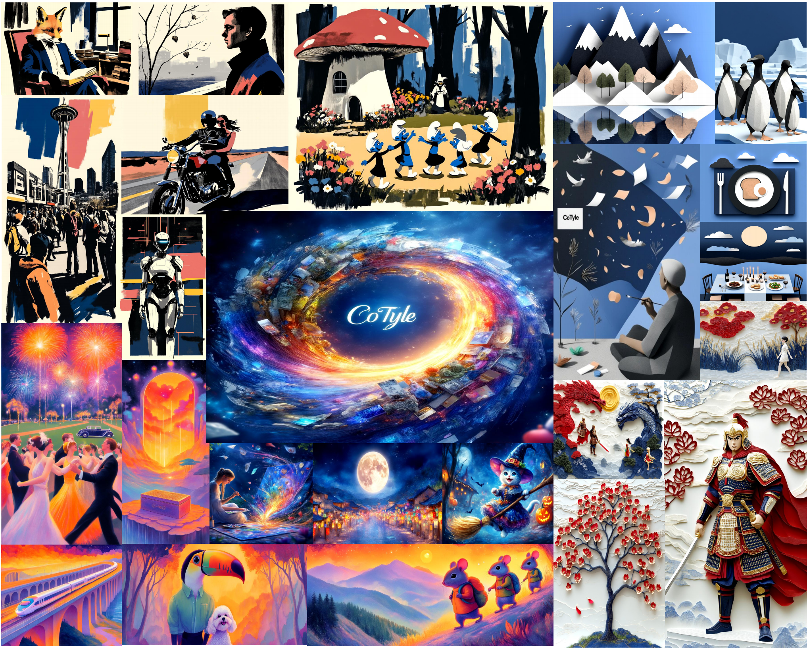
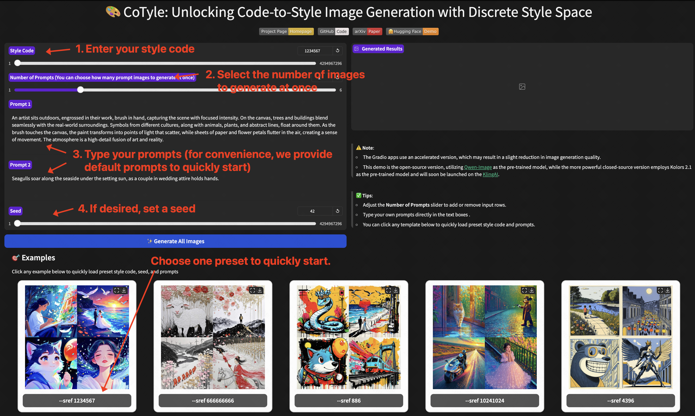

# 🎨 **[CVPR2026 Oral&Award Candidate]** A Style is Worth One Code: Unlocking Code-to-Style Image Generation with Discrete Style Space
<p align="center"> 
    <a href="https://arxiv.org/abs/2511.10555"></a>
    <a href="https://Kwai-Kolors.github.io/CoTyle/"></a> 
    <a href="https://github.com/Kwai-Kolors/CoTyle"></a> 
    <a href="https://huggingface.co/spaces/Kwai-Kolors/CoTyle"></a>
    <a href="https://huggingface.co/Kwai-Kolors/CoTyle"></a>
</p>

<p align="center">
    <span style="color:#137cf3; font-family: Gill Sans">Huijie Liu</span><sup>1,2</sup>,
    <span style="color:#137cf3; font-family: Gill Sans">Shuhao Cui</span><sup>2</sup>,
    <span style="color:#137cf3; font-family: Gill Sans">Haoxiang Cao</span><sup>2,3</sup>,
    <span style="color:#137cf3; font-family: Gill Sans">Shuai Ma</span><sup>1</sup>,
    <span style="color:#137cf3; font-family: Gill Sans">Changqian Yu</span><sup>2,†</sup>,
    <span style="color:#137cf3; font-family: Gill Sans">Guoliang Kang</span><sup>1,†</sup>
    <br>
    <sup>1</sup><span style="font-size: 16px">Beihang University</span>,
    <sup>2</sup><span style="font-size: 16px">Kolors Team, Kuaishou Technology</span>, 
    <sup>3</sup><span style="font-size: 16px">South China Normal University</span>
    <br>
    <sup>†</sup><span style="font-size: 16px">Co-Corresponding Author</span>
</p>

> This repository offers the official code of the paper *"A Style is Worth One Code: Unlocking Code-to-Style Image Generation with Discrete Style Space"*. We provide both an Open-Source Version (based on Qwen-Image) and a Commercial Version (based on Kolors). If you are a professional developer and interested in further developing the CoTyle Open-Source Version, please follow the tutorial below. The Commercial Version is coming soon.

<p align="center">

</p>


## 🔥 News
- [04/10/2026] The paper of CoTyle has been accepted as an **Oral at CVPR 2026**.
- [11/18/2025] The [demo](https://huggingface.co/spaces/Kwai-Kolors/CoTyle) of CoTyle is released on Hugging Face.
- [11/18/2025] The [weights](https://huggingface.co/Kwai-Kolors/CoTyle) of CoTyle are released on Hugging Face.
- [11/18/2025] The [code](https://github.com/Kwai-Kolors/CoTyle) is released!
- [11/18/2025] The [homepage](https://Kwai-Kolors.github.io/CoTyle/) of CoTyle is released.
- [11/14/2025] The [paper](https://arxiv.org/abs/2511.10555) of CoTyle is released.

## 📝 ToDo
- [x] Publish the paper on Arxiv.
- [x] Release the homepage of CoTyle.
- [x] Launch a free demo on Hugging Face Spaces of CoTyle.
- [x] Open source the code and model weights of CoTyle.
- [ ] Release the commercial version of CoTyle.

## 📖 Abstract
Innovative visual stylization is a cornerstone of artistic creation, yet generating novel and consistent visual styles remains a significant challenge. Existing generative approaches typically rely on lengthy textual prompts, reference images, or parameter-efficient fine-tuning to guide style-aware image synthesis, but often struggle with style consistency, limited novelty, and complex style representations. In this paper, we affirm that a style is worth one numerical code by introducing the novel task, code-to-style image generation, which produces images with novel, consistent visual styles conditioned solely on a numerical style code. To date, this field has only been primarily explored by the industry (e.g., Midjourney), with no open-source research from the academic community. To fill this gap,
we propose CoTyle, the first open-source method for this task. Specifically, we first train a discrete style codebook from a collection of images to extract style embeddings. These embeddings are used to condition a text-to-image diffusion model (T2I-DM) for style-consistent generation. Subsequently, we train an autoregressive transformer on the quantized style codes to model their distribution, allowing the synthesis of novel style codes. During inference, a numerical code maps to a unique style sequence,
which guides the diffusion process to produce images in the corresponding style. Unlike existing methods, our approach offers unparalleled simplicity and diversity, unlocking a vast space of reproducible styles from minimal input. Extensive experiments validate that CoTyle effectively turns a numerical code into a style controller, demonstrating a style is worth one code.

## ⚡️ Quick Start
### 🔧 Requirements and Installation
Run the following command to install the requirements.
```bash
git clone https://github.com/Kwai-Kolors/CoTyle
cd CoTyle
conda create -n cotyle python=3.10 
conda activate cotyle
pip install torch==2.6.0 torchvision==0.21.0
pip install -e git+https://github.com/Lakonik/piFlow.git@b1ef16e5e305251bccdfeac2a0e3d0ef339b974a#egg=lakonlab --no-build-isolation
pip install -r requirements.txt
# After running, some dependency errors may appear (don’t meet lakonlab’s requirements). 
# This is normal and can be ignored.
```

### ⏬ Download
Please download the checkpoints and put them to the `./pretrained_models` directory.
You can download them from [Hugging Face](https://huggingface.co/Kwai-Kolors/CoTyle/tree/main).
```bash
git lfs install
git clone https://huggingface.co/Kwai-Kolors/CoTyle
mv CoTyle pretrained_models
```

### 🚄 Code-to-Style Generation
For a quick walkthrough of the inference pipeline, we recommend generating a single image (see Single-Sample Generation).
To intuitively experience the powerful capabilities of CoTyle, we recommend generating a batch of images (see Batch-Sample Generation), which by default produces 42 images (7 style codes × 6 prompts).


#### Batch-Samples Generation
Run the following command to generate a batch of images. By default, 7 rows and 6 columns of images will be generated, where all images in each row are produced using the same style code, and all images in each column are generated using the same prompt. 
You can adjust the `--style_code` and the content in `./test_prompts.txt` to obtain the desired outputs.

This process may take considerable time. 
Therefore, we provide an accelerated version based on [piFlow](https://github.com/Lakonik/piFlow), which requires only 4 denoising steps; however, this approach produces lower image quality.
Enable `--accelerate` to activate piFlow.
```bash
python inference_batch.py --model_path ./pretrained_models \
  --style_code 1234567 5201314 13415926 886 20010627 996007 2333 \
  --prompt_file_path ./test_prompts.txt \
  --output_path outputs \
  --seed 1024 \
  --accelerate
```

If time permits, we strongly recommend executing the command below.
```bash
python inference_batch.py --model_path ./pretrained_models \
  --style_code 1234567 5201314 13415926 886 20010627 996007 2333 \
  --prompt_file_path ./test_prompts.txt \
  --output_path outputs \
  --seed 1024 \
```

After successful execution, you will obtain the following results:
<p align="center">

</p>


#### Single-Sample Generation
Execute the following code for single-sample inference. You can generate desired results by adjusting the `--style_code` and `--prompt`.

```bash
python inference.py --model_path ./pretrained_models \
  --style_code 1234567 \
  --prompt "A lovely crystal snake spirit, slender and nimble, wears an exquisite crystal crown atop its head. Its scales are translucent, shimmering like crystal, its eyes are bright and round, and its expression is lively. Its body coils naturally, its tail gracefully curved, its overall posture harmonious and beautiful." \
  --output_path outputs \
  --seed 1024
```
Similarly, you can enable the `--accelerate` to speed up.

## 📲 Gradio Apps
We provide Gradio apps for interactivate inference with the CoTyle.

Official apps are available on [HuggingFace Spaces](https://huggingface.co/spaces/Kwai-Kolors/CoTyle).


If you want to run it locally, please execute:
```bash
python app.py
```

<strong>Note</strong>: The Gradio apps use an accelerated version, which may result in a slight reduction in image generation quality.

<strong>Tips</strong>:
- Adjust the <strong>Number of Prompts</strong> slider to add or remove input rows.
- Type your own prompts directly in the text boxes.
- You can click any template below to quickly load preset style code and prompts.
<p align="center">

</p>


##  🌟 Citation
If CoTyle is helpful, please help to ⭐ the repo.

If you find this project useful for your research, please consider citing our paper:
```bibtex
@misc{liu2025styleworthcodeunlocking,
      title={A Style is Worth One Code: Unlocking Code-to-Style Image Generation with Discrete Style Space}, 
      author={Huijie Liu and Shuhao Cui and Haoxiang Cao and Shuai Ma and Kai Wu and Guoliang Kang},
      year={2025},
      eprint={2511.10555},
      archivePrefix={arXiv},
      primaryClass={cs.CV},
      url={https://arxiv.org/abs/2511.10555}, 
}
```

## 💌 Acknowledge
This code builds on [diffusers](https://huggingface.co/docs/diffusers/index), [Qwen-Image](https://github.com/QwenLM/Qwen-Image), [piFlow](https://github.com/Lakonik/piFlow) and [UniTok](https://github.com/FoundationVision/UniTok). Thanks for open-sourcing!
